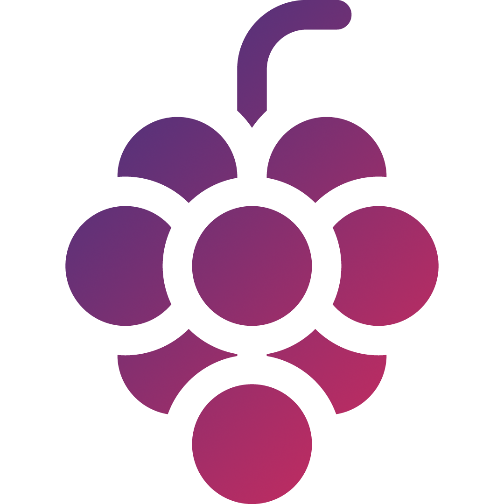
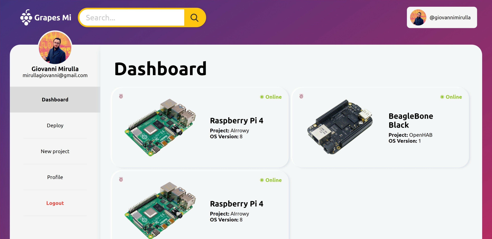
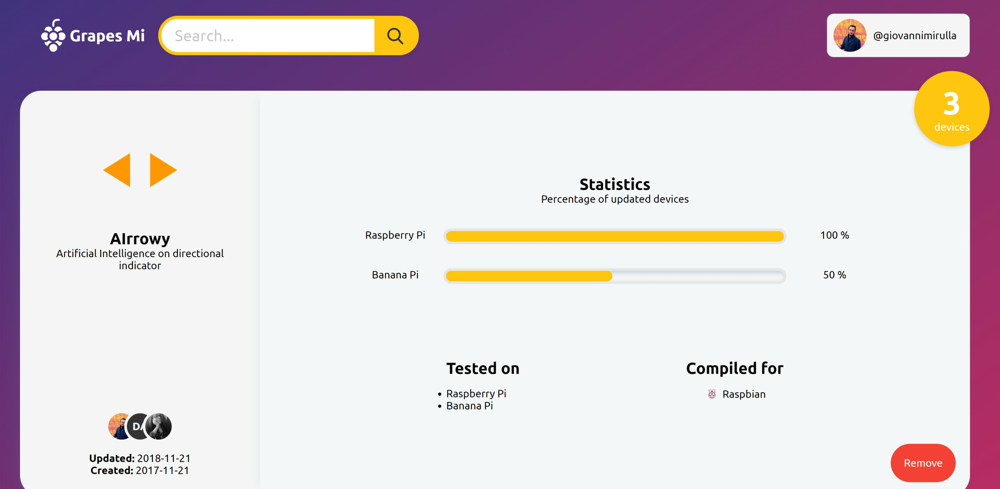
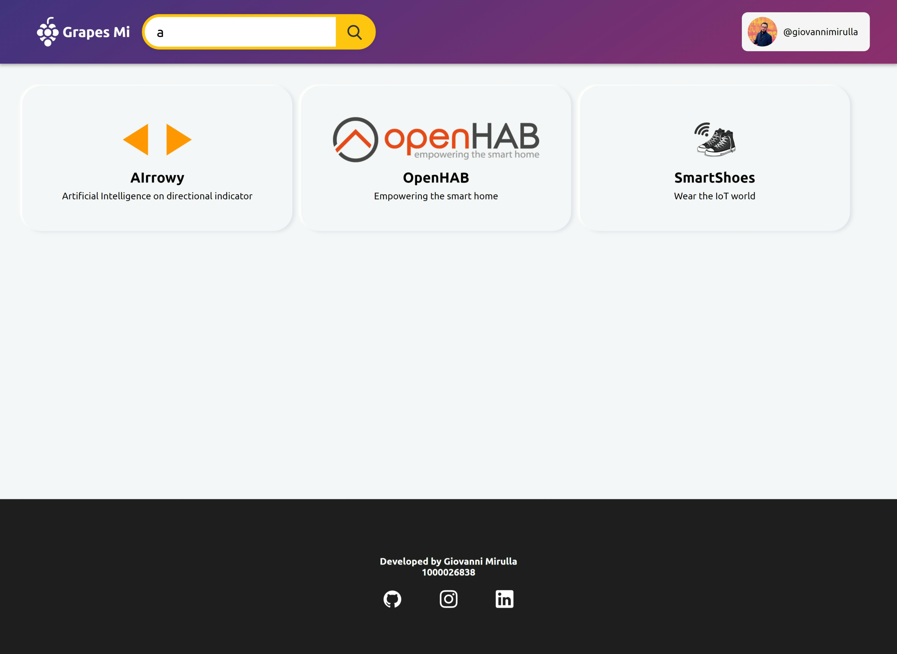
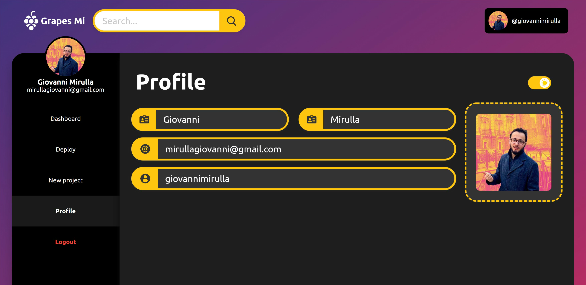
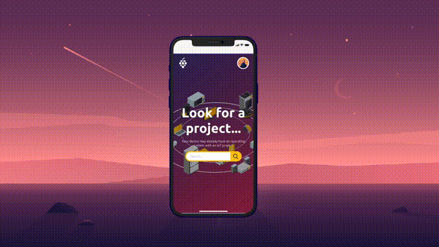

 
<h1>Grapes Mi</h1>

## About Grapes Mi

Grapes Mi is a web application to manage the creation of operating systems for IoT devices and their distribution

## Profile

## Project

## Search

## Dark Mode

## Mobile

